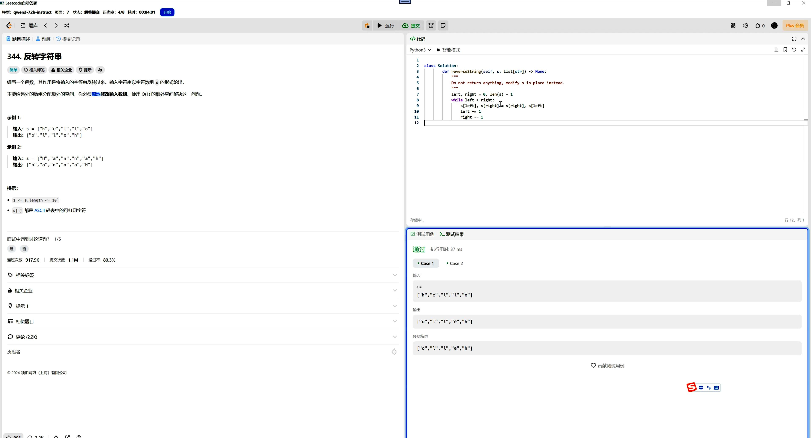

# autoleetcode

#### 介绍
使用cefsharp网页自动化读取Leetcode题目，交给不同的大模型处理，自动提交统计正确率

目前看顶尖的大模型尚不能高正确率的通过中等难度题目，预期通过微调AlchemistCoder提高准确率

#### 软件架构
- C# 客户端
- Python 服务端

#### 安装教程

编译后双击即可启动，登录Leetcode（会保存cookie），选择页码，点击Start开始自动运行

#### 使用说明

适配了openai接口，config.json中可以配置BaseUrl和ApiKey

#### 示例图

